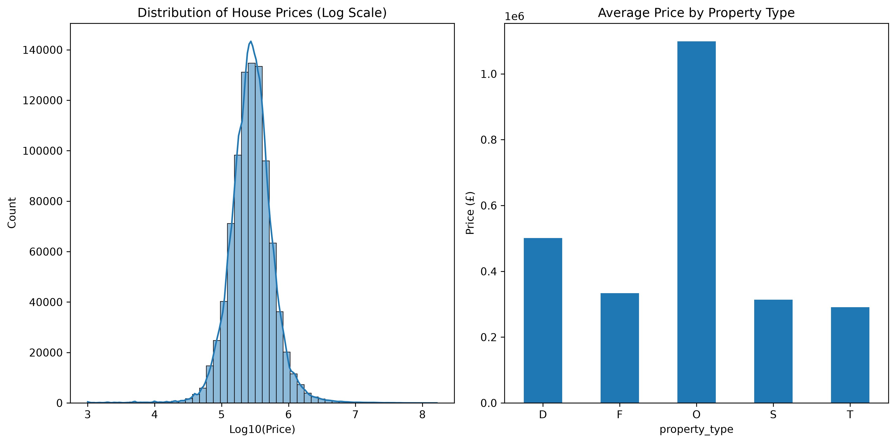
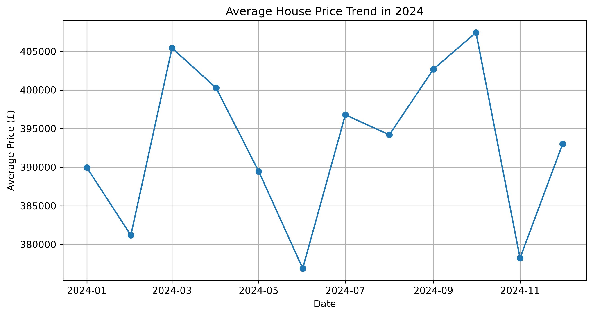

# UK House Price Analysis 2024 🏠🦀


## Overview
End-to-end data cleaning and exploratory analysis of 927k+ UK residential property transactions from official HM Land Registry Price Paid Data (2024).

**Highlight**: Identified a classic crab market 🦀 — lots of volatility but prices ended the year basically flat.

## Visualizations

  
*Distribution of house prices (log scale)*

  
*Monthly average price trend throughout 2024*

## How to Run
```bash
git clone https://github.com/kofimanu2403/uk-house-price-analysis.git
cd uk-house-price-analysis
./start.sh
```

## What I Learned / Skills Demonstrated
- Cleaning messy real-world government data with pandas (handling missing values, data types, outliers)
- Exploratory data analysis and creating clear visualizations with matplotlib and seaborn
- Working with large CSV files and building reproducible project setups
- Turning raw data into meaningful insights (including spotting the crab market pattern)

## Project Structure
- `data_cleaning_analysis.ipynb` — Main analysis + code
- `price_distribution.png`, `price_trend_2024.png` — Key visualizations
- `start.sh` — One-click environment launcher

---
**Beginner Data Analysis Portfolio Project**
